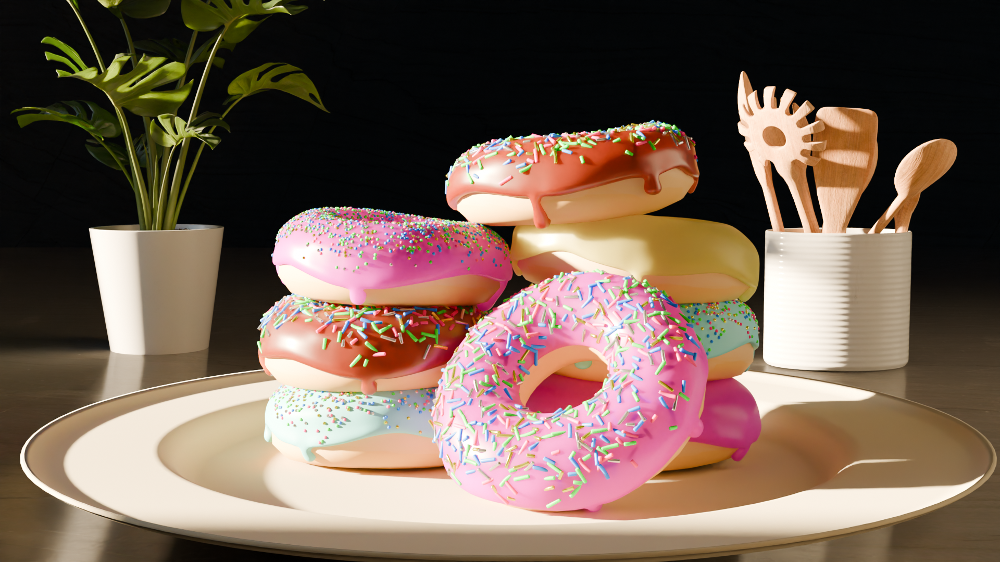

# 3D Donut Animation Project 🍩

A comprehensive 3D modeling and animation project created in **Blender**. This repository contains the source files for a stylized donut scene, focusing on organic modeling, procedural texturing, and geometry nodes.

## 🖼️ Preview

---

## 📂 Project Structure

To manage performance on a **Mac M1** system, the project is organized into dedicated files for each stage of the workflow:

* **Layout.blend:** Contains the base modeling, scene arrangement, and initial asset placement.
* **Animation.blend:** Focuses on the movement, keyframing, and camera paths.
* **Compositing.blend:** Handles the final scene assembly, lighting, and node-based compositing.

## 🛠️ Technical Highlights

* **Geometry Nodes:** Procedural distribution and randomization of sprinkles.
* **Sculpting:** Used for the organic deformation of the icing and the "fried" bread texture.
* **Shading:** Custom procedural textures for the glossy icing and realistic subsurface scattering.
* **M1 Optimization:** Utilized a split-file workflow to maintain high viewport FPS during the design phase.

## 🚀 How to Use
1. Clone the repository using `git clone`.
2. Ensure you have **Blender 4.0+** installed.
3. Open the `.blend` files. If textures appear pink/missing, go to `File > External Data > Find Missing Files` and select the repository folder.

---
**Created by Karan** *Physics Student | Robotics Enthusiast | 3D Designer*
